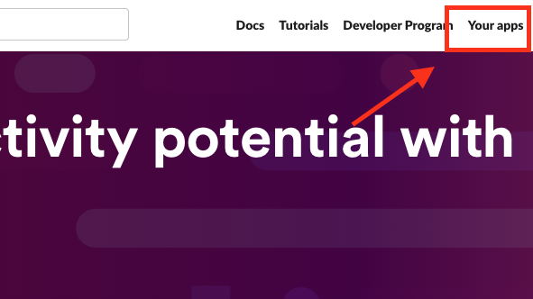
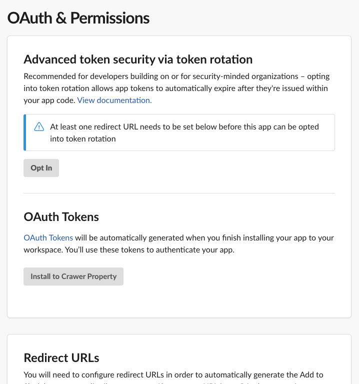
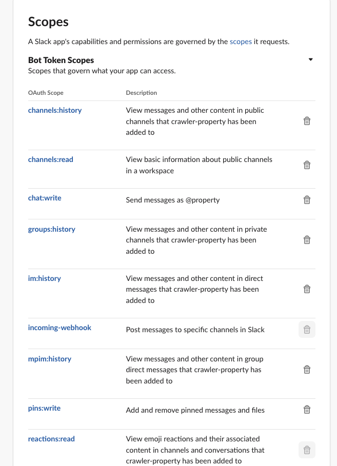
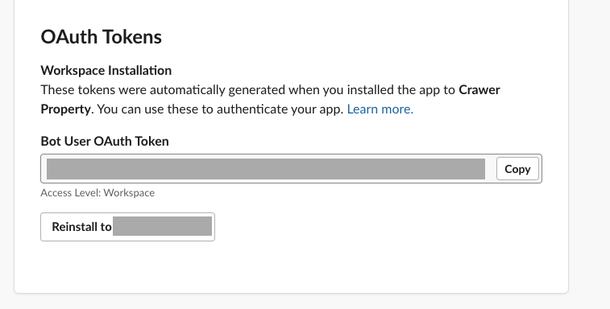

# SUUMO Crawler And Notify Tool

## 概要

- 新しい候補の家を通知する
- 一緒に住むことを検討している人に通知して、スムーズな意思決定を促進する

## 特徴

- 条件に合った新しい家を通知
- 新しいボットメッセージに誰かが反応したときに通知
    - 将来の同居人がメッセージに反応した場合、通知を受け取ります。
- お気に入りの家をリストアップ
    - 特定のアイコンで反応すると、ボットがメッセージをピン留めします。
    - 反応した物件はスプレッドシートにリストアップされ、管理が容易になります。（反応しなかった物件は削除されます）

## 使用方法
### スプレッドシートへの書き込み機能を有効にする

スプレッドシートへの書き込み機能を有効にするには、以下の手順に従って`credentials.json`を作成します（必ず`credentials.json`にリネームしてください）。作成した`credentials.json`をプロジェクトのルートに配置します。  
[Google Sheets API Quickstart for Python](https://developers.google.com/sheets/api/quickstart/python?hl=ja)

### Slackにメッセージを投稿する方法

1. **`.env.example`をコピーする:**
```shell
   cp .env.example .env
```

2. **Slackでトークンを作成し、`.env` ファイルに記入する**

手順:

1. Slack APIにログイン: [Slack API](https://api.slack.com/)にアクセスし、アプリを選択します。

2. OAuth & Permissionsページ: 左側のメニューから「OAuth & Permissions」を選択します。

3. Bot Token Scopes: 「Bot Token Scopes」セクションで、アプリに必要なスコープを追加します。このプロジェクトで必要な権限は以下です。:
- chat:write (メッセージの投稿)
- channels:read (チャンネル情報の読み取り)
- channels:history
- groups:history
- im:history
- mpim:history
- incoming-webhook
- pins:write
- reactions:read

4. OAuthトークンの再生成: スコープを追加した後、「OAuth Tokens for Your Workspace」セクションで「Reinstall App」ボタンをクリックして新しいトークンを生成します。
