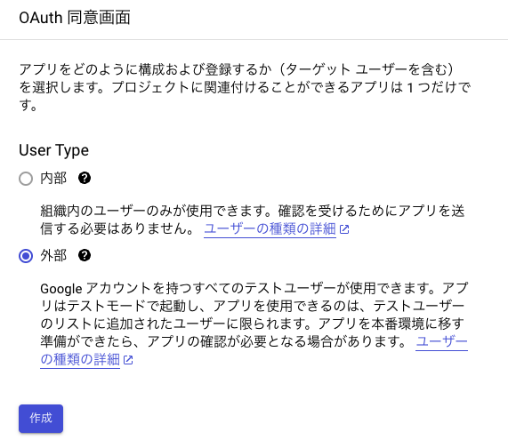
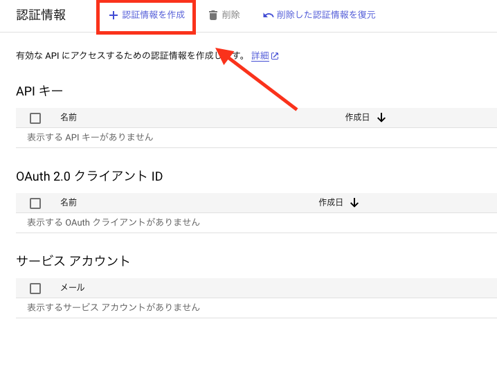

# SpreadSheet側の設定

## API を有効にする

Google Cloud コンソールで、Google Sheets API を有効にします。

[API の有効化](https://console.cloud.google.com/flows/enableapi?apiid=sheets.googleapis.com&hl=ja)

## OAuth 同意画面を構成する

すでに設定済みであれば、こちらはスキップしてください。

Google Cloud コンソールで、メニューに移動します。

1. [APIとサービス] → [OAuth 同意画面]
2. [ユーザーの種類] で [内部] を選択し、[作成] をクリックします。個人ユーザーの場合は内部が選択できないので、外部を選択します。

3. アプリ登録フォームで必要項目を入力し、[保存して次へ] をクリックします。
4. 現時点では、スコープの追加をスキップして [保存して次へ] をクリックします。必要に応じてアプリに必要な認証スコープを追加してください。
5. アプリ登録の概要を確認します。アプリに問題がなければ、[ダッシュボードに戻る] をクリックします。
6. 認証情報を作成します。認証情報から [認証情報を作成] → [OAuth クライアント ID]

＜設定値＞

アプリケーションの種類： ウェブ アプリケーション

名前： 任意の名前

7. 作成したクライアント シークレットは後ほど使用するので控えておきます。
