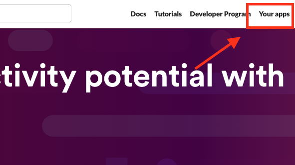
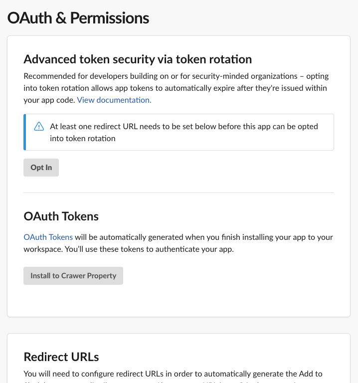
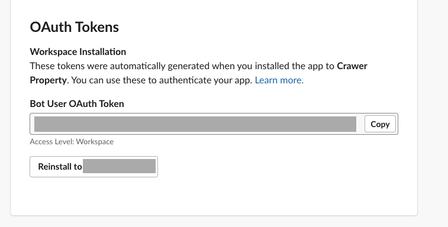
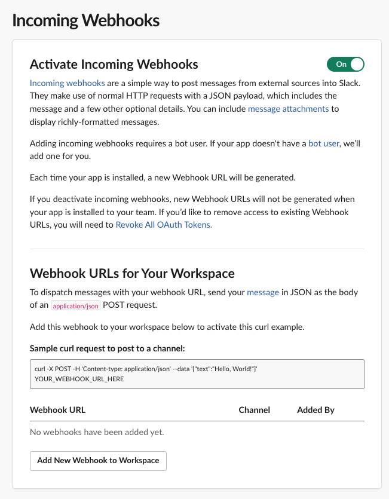
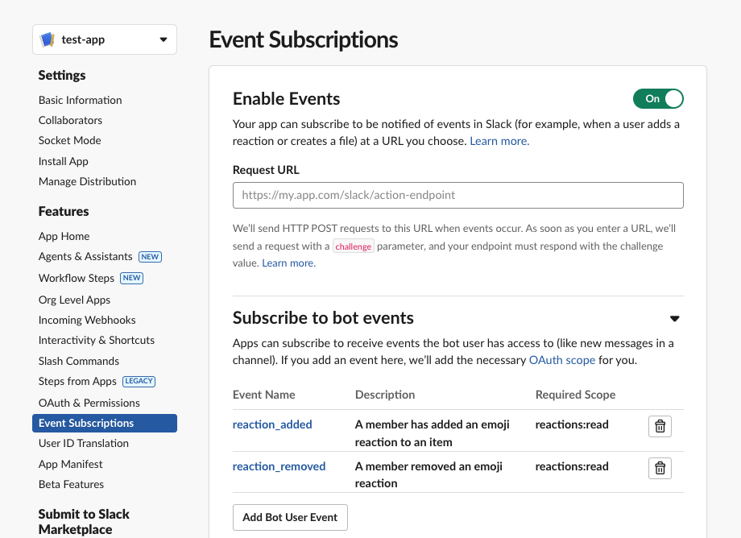
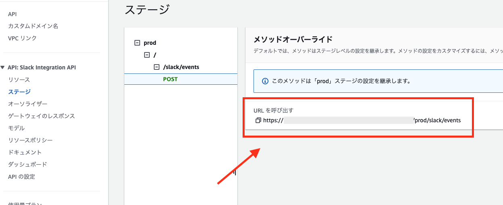

# Slackの設定

## Slackに通知を送る設定

1. Slack APIにログイン: [Slack API](https://api.slack.com/)にアクセスし、アプリを選択します。

2. OAuth & Permissionsページ: 左側のメニューから「OAuth & Permissions」を選択します。

3. Bot Token Scopes: 「Bot Token Scopes」セクションで、アプリに必要なスコープを追加します。このプロジェクトで必要な権限は以下です。

- chat:write (メッセージの投稿)
- channels:read (チャンネル情報の読み取り)
- channels:history
- groups:history
- im:history
- mpim:history
- incoming-webhook
- pins:write
- reactions:read

4. OAuthトークンの再生成: スコープを追加した後、「OAuth Tokens for Your Workspace」セクションで「Reinstall App」ボタンをクリックして新しいトークンを生成します。

5. Incoming Webhooksからwebhook URLを払い出す
※後ほどURLは使うので控えておく

6. 通知したいSlackのチャンネルをLambdaの環境変数に設定する
`cdk/crawling_batch_stack.py` の `TARGET_SLACK_CHANNEL` に値を入れる。

## Slackで👍したら、ピン留め(+スプレッドシートを有効にしてたらスプレッドシートにハイライト)したい

1. Slack APIの画面から [Event Subscriptions] を選択: [Slack API](https://api.slack.com/)にアクセスし、アプリを選択します。

2. [Subscribe to bot events] で `reaction_added` と `reaction_removed` を選択する

3. AWSコンソールのAPI Gatewayから、APIをコピーする

4. slack apiの [Request URL] にペーストし、リクエストがVerifiedになればOK。  [Save Changes] で保存してください。

5. Slackに戻り、物件情報を流したいチャンネルに作ったAppを招待して完了です。

