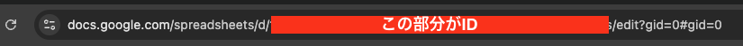

# CDKデプロイ準備

本プロジェクトのCDKはParameter StoreにSlackの設定を格納しています。
そのため `cdk deploy` の前にParameter Storeに値を入れます。
**※デプロイしたいリージョンに作成してください**

## Slackを使用する場合

・SlackのWebhook URL

パラメータ名： `/crawling-houses/slack/webhook/url`

タイプ： 文字列

データ型： text

値： Slack Webhook URLをペースト

・Slack Token

パラメータ名： `/crawling-houses/slack/token`

タイプ： 文字列

データ型： text

値： OAuth&Permissions の Slack Tokenをペースト

## スプレッドシートを使用する場合

・スプレッドシートID

パラメータ名： `/crawling-houses/spreadsheet/id`

タイプ： 文字列

データ型： text

値： IDは以下で確認できます

・GCのクレデンシャル

パラメータ名： /crawling-houses/google/credentials

タイプ： 文字列

データ型： text

値： 作成したクライアント シークレット
