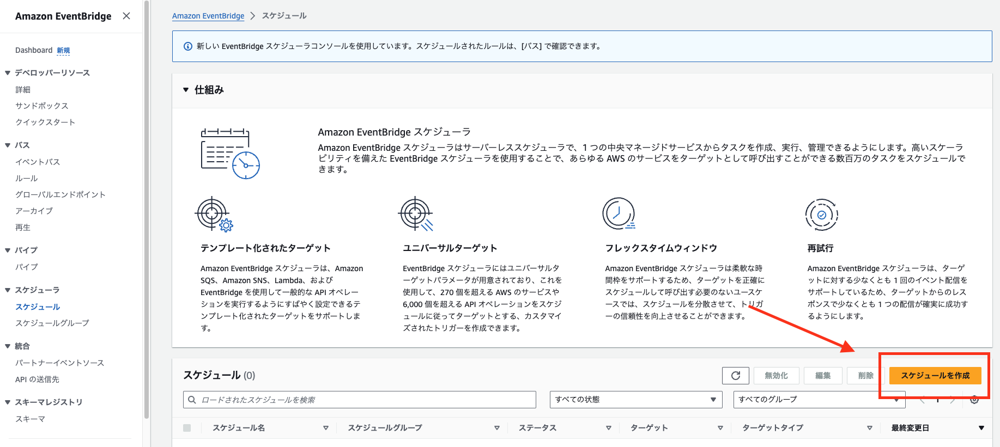
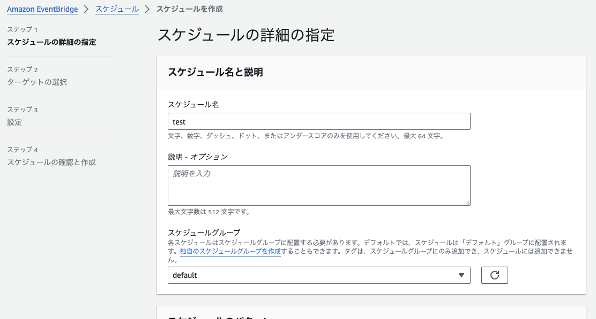
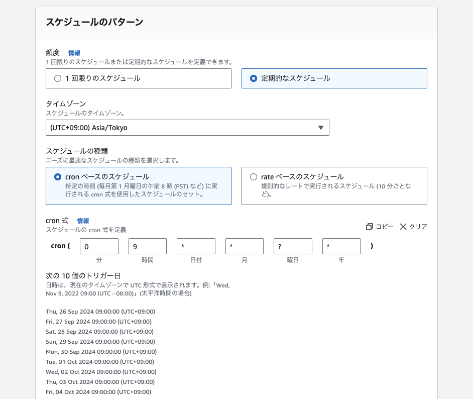
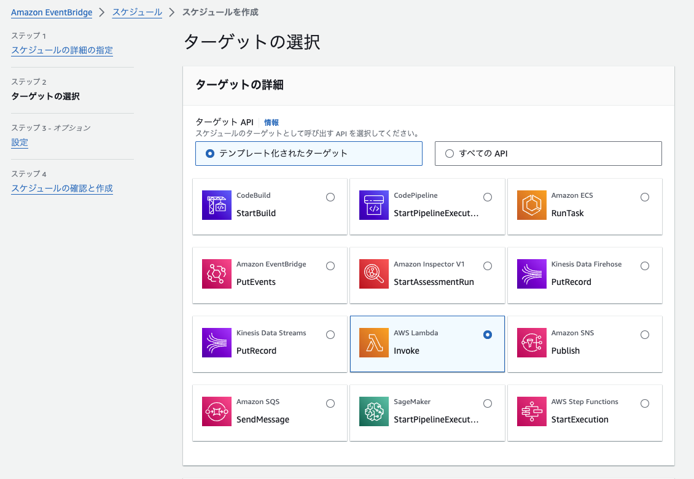
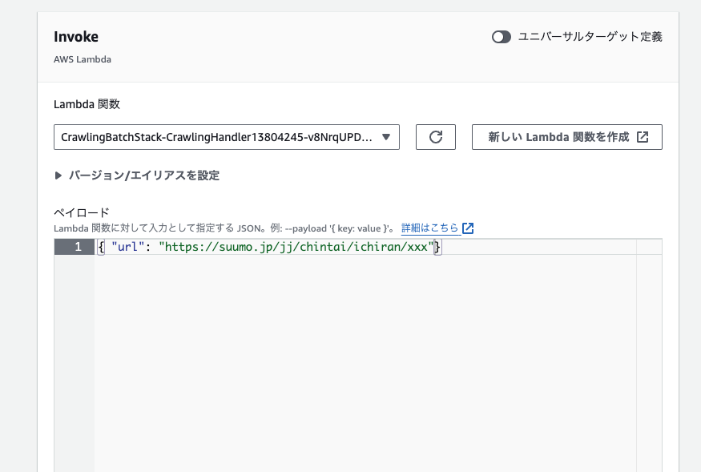
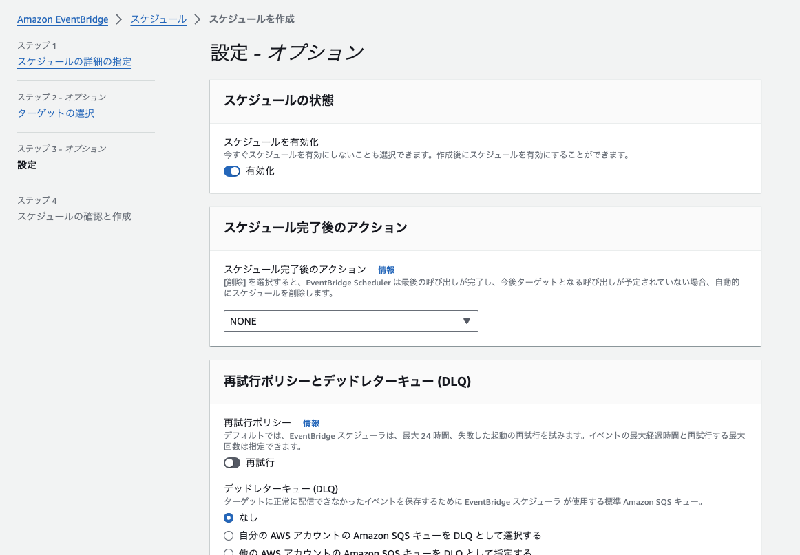

## クローリング対象のURLを設定する

管理上、クローリング対象のURLはコンソールから作った方が良さそうだったので、コンソールからEvent Bridgeを作成してください。
複数のルールを設定することで、複数URLをクローリングすることができます。

1. スケジュールを作成

2. cronを設定する
フレックスタイムウィンドウは好きな値を設定してください。






### ペイロード

```json
{ "url": "https://suumo.jp/jj/chintai/ichiran/xxx" }
```
